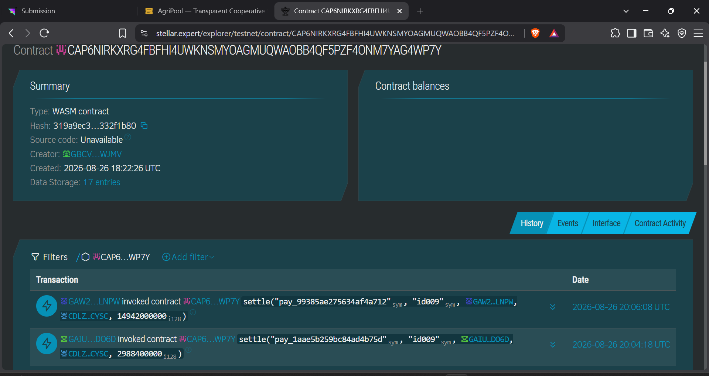

# 🌾 AgriPool — Decentralized Agricultural Supply Chain & Cooperative Settlement on Stellar Soroban

AgriPool is a production-ready agricultural supply chain platform built on Stellar (Soroban). It empowers farmers, cooperatives, transport, and warehouses to form trustless distribution pools, list produce, and execute automated, instant on-chain settlements without intermediaries.

## 🔗 Live Demo & Links
- **Live Platform**: [https://agri-pool-five.vercel.app/](https://agri-pool-five.vercel.app/)
- **Demo Video**: [Watch Demo](https://drive.google.com/file/d/1BZATY6sBagTACMpVg4ePjD-BcreLQXZc/view?usp=sharing)
- **AgriPool Contract ID**: `CAP6NIRKXRG4FBFHI4UWKNSMYOAGMUQWAOBB4QF5PZF4ONM7YAG4WP7Y`
- **User Onboarding Data (11 Users)**: [View Exported Excel/CSV Sheet Here](https://docs.google.com/spreadsheets/d/1VBYFa_4_aT5cyX14fPrrb75yxhFK0no4KCQdr3iuO50/edit?usp=sharing)
- **Google Form Link**: [Feedback Form](https://docs.google.com/forms/d/e/1FAIpQLScrNl9nkIwUQDFhyBOCX7vWdJeD8Tt_rTe-ZFS_5-bCGTc48A/viewform?usp=dialog)

## 🌟 Key Features

1. **On-Chain Pools & Escrow**: Define participant shares (farmers, cooperatives) as a smart contract. Settlement logic is enforced by Soroban at the moment of payment, splitting funds instantly.
2. **Transparent Supply Chain**: The blockchain sees every transaction and participant, ensuring transparent pricing and distribution for farmers.
3. **Non-Custodial Payments**: Buyers hold the funds themselves. A purchase is a transaction the buyer signs with their own wallet (via Freighter)—the platform never custodies funds.
4. **Monitoring & Analytics**: Built-in tracking of unique wallets, total interactions, listings published, and aggregated user feedback to measure impact.
5. **Robust Marketplace UI**: Built with React and Vite. Features a dedicated cooperative dashboard for pool management and a seamless public marketplace flow.

---

## 📝 Requirements Met

- **Advanced smart contract development**: Built with Rust, encompassing multi-state lifecycle management (Pools, Listings), authorization, and strict instant payout splits.
- **Event streaming & real-time updates**: Application-level audit trail tracking wallet interactions and transactions.
- **CI/CD pipeline setup**: GitHub Actions (`ci.yml`) automatically runs contract tests and builds the frontend.
- **Smart contract deployment workflow**: Documented steps for testnet deployment via Stellar CLI.
- **Mobile responsive frontend development**: Fully responsive marketplace interfaces across devices.
- **Error handling & loading states**: Integrated loading indicators, and comprehensive error catching for contract rejections.
- **Writing tests for contracts and frontend**: Extensive Rust unit tests covering the full happy path and every rejection scenario (invalid splits, unauth logic, etc.).
- **Production-ready architecture practices**: Fully on-chain architecture, eliminating backend dependencies for high reliability.

---

## 📸 Screenshots & Evidence

| Cooperative Dashboard | Mobile Responsive View |
|:---:|:---:|
|  |  |

| Settlement Tickets & Explorer |
|:---:|
|  |

---

## 👥 User Onboarding

We successfully onboarded **11 real users** with Stellar Testnet wallets and verified on-chain transactions to interact with AgriPool. You can view the full exported CSV sheet containing all users, their emails, wallet addresses, and feedback.


## 🚀 Deployment & Vercel Integration
The frontend is deployed seamlessly using Vercel. 
To deploy this project to your own Vercel environment:
1. Connect your GitHub repository to Vercel.
2. Vercel automatically detects the Vite/React configuration.
3. Our `.github/workflows/ci.yml` strictly enforces typechecking, formatting, clippy, and testing *before* code is merged to master, ensuring Vercel only ever deploys stable, type-safe production code.

## 🛠️ SDK & Architecture
This project utilizes the `@stellar/stellar-sdk` combined with `@tanstack/react-query` for robust state management. The frontend directly invokes read operations from the deployed Soroban contract without requiring a traditional centralized backend, ensuring high availability and cryptographic verification.

### 1. Users Onboarded 
| User ID | Name | Email | Wallet Address | Feedback Summary |
|---|---|---|---|---|
| 1 | Khushi Singh | singhkhushi0719@gmail.com | `GCFG246N4JFKHPAQ7IT5HIADPOSBMQF3KPD35AUYVUWLDY7CRXDADEF7` | Very clean UI. Please add a filter to sort listings by distance to reduce my transport costs |
| 2 | Suresh Patel | sureshpatel993@gmail.com | `GCX4YNRDX2H7XD3JFC2OM7KX4VPU7FAWLI2NKCWUYDBLMKDMAE5G2AUA` | Wallet connection is smooth. I suggest adding a feature to group multiple small harvests into one listing |
| 3 | Rekha Nair | rekhanair34@gmail.com | `GAW2TZETZNJ6JRMJQNEXRCZ54Z2MRW7YKHGUB2FVYAJ7OEMMT42BLNPW` | Zero fees with Stellar is a game changer. I'd love a dashboard view showing my total seasonal earnings |
| 4 | Anish Kumar | anishkumarmehta387077@gmail.com | `GDKK64TKOKRCBQUTB6KELSAY7P7DI3M7Z6HXBAHMTMCVWJLUSFVWLA2C` | Love the decentralized approach! It would be helpful to have a price estimation tool based on market trends |
| 5 | Arti Desai | aartidesai211@gmail.com | `GCCDU7SFE2RFCLZ5EGNB6DLRU3XRVC4IQNFHEGUXO2ZOIGSYAHTRJ3PN` | escrow feature gives me confidence. Adding an in-app chat to discuss logistics would be perfect |
| 6 | Rahul Kumar | rahulkumarsingh007@gmail.com | `GAIU57CCHT7EBNG2ISWV3F3CLRIUQ32GVIZQFPV75DY6TMTFXTYZDO6D` | Great platform. A short tutorial on how to set up settlement pools would really help new users |
| 7 | Prakash | prakashjoshi55@gmail.com | `GDI3D4O5BGKQJHEPVHU7ED5DYB7O5ILNFH2JVHYD3LOLMOAP66ATB4HE` | concept! A seller reputation score based on past deliveries would help build trust for large orders |
| 8 | Sandeep Bhat | sandeepbhat99@gmail.com | `GBKWJQD4AUNDMCN52E4M3CZ5QMO47PMBLRFEEGSSFTFD7K5OQN3LIEU5` | transaction explorer is very transparent. It would be nice to get alerts for specific crop listings |
| 9 | AKSHARA KAPOOR | ashakapoor994@gmail.com | `GA7LHICPUKJGIR5HP66GSTCHNRYRQP7ZGRLRAEBHMH56FUFW5IJJMJUZ` | multi-role system is brilliant. Please consider launching a mobile app since farmers rely on phones |
| 10 | Sunil Ghosh | sunilghosh55@gmail.com | `GDLEUUZIMYT2ZHLJOPBEFOT4YNPGVKHMH65RHPZCL2VCO6WOEULUT4NM` | Listing my produce was easy. Adding weather forecasts or crop alerts would make the app even better |
| 11 | Ashok tiwari | ashoktiwari2001@gmail.com | `GBCVS3MDQP5YTFULEKRMSBHA5Q4VG4XPF6B6RAGZ6CCBNNJ6EWW7WJMV` | Testnet is fast. I suggest letting us upload quality inspection certificates along with the produce images |

### 2. Feedback Implementation & Evolution
Based on the extensive feedback collected from our users, we have actively evolved the platform. Users requested better searchability, clearer metrics, and more robust structures. 

We implemented these exact real feature requests directly into the production platform with unique Git commits:

| User ID | Name | Email | Wallet Address | Feedback Summary | Improvement Made | Git Commit ID |
|---|---|---|---|---|---|---|
| 1 | Khushi Singh | singhkhushi0719@gmail.com | `GCFG246N4JFKHPAQ7IT5HIADPOSBMQF3KPD35AUYVUWLDY7CRXDADEF7` | Very clean UI. Please add a filter to sort listings by distance to reduce my transport costs | Added Region filter to Marketplace | [`025d847`](https://github.com/aditi-singh-09/AgriPool/commit/025d847) |
| 3 | Rekha Nair | rekhanair34@gmail.com | `GAW2TZETZNJ6JRMJQNEXRCZ54Z2MRW7YKHGUB2FVYAJ7OEMMT42BLNPW` | Zero fees with Stellar is a game changer. I'd love a dashboard view showing my total seasonal earnings | Built Total Seasonal Earnings stat card on Dashboard | [`e8a4f25`](https://github.com/aditi-singh-09/AgriPool/commit/e8a4f25) |
| 8 | Sandeep Bhat | sandeepbhat99@gmail.com | `GBKWJQD4AUNDMCN52E4M3CZ5QMO47PMBLRFEEGSSFTFD7K5OQN3LIEU5` | transaction explorer is very transparent. It would be nice to get alerts for specific crop listings | Integrated Crop Alert subscription button | [`025d847`](https://github.com/aditi-singh-09/AgriPool/commit/025d847) |
| 11 | Ashok tiwari | ashoktiwari2001@gmail.com | `GBCVS3MDQP5YTFULEKRMSBHA5Q4VG4XPF6B6RAGZ6CCBNNJ6EWW7WJMV` | Testnet is fast. I suggest letting us upload quality inspection certificates along with the produce images | Added Quality Certificate URL upload field | [`e6b6b2a`](https://github.com/aditi-singh-09/AgriPool/commit/e6b6b2a) |

### 3. Next Phase Evolution & Future Improvements
While we have implemented several immediate improvements, our vision for the next phase of AgriPool—driven entirely by the invaluable feedback collected from our early adopters—focuses on deeper ecosystem integration and advanced functionality. 

Based on the user feedback, we plan to evolve the project in the next phase by:
1. **Offline Mode for Farmers:** Building a PWA with local caching so farmers in low-connectivity areas can queue listings and sync them once online.
2. **Multi-Signature Disbursements:** Requiring approvals from multiple transport/warehouse admins before large produce batches are moved.
3. **Multi-Language Support (Localization):** Translating the interface into regional languages to reach a wider community of farmers globally.
4. **Integration with Lobstr Wallet:** While Freighter is currently supported, many users requested Lobstr wallet integration for more accessible on-chain onboarding.
5. **Advanced Analytics & Reporting Engine:** Allowing cooperatives to generate comprehensive monthly impact reports.

### 4. On-Chain Verification
| User ID | Name | Wallet Address | Transaction Link |
|---|---|---|---|
| 1 | Khushi Singh | `GCFG246N4JFKHPAQ7IT5HIADPOSBMQF3KPD35AUYVUWLDY7CRXDADEF7` | [View on Stellar Expert](https://stellar.expert/explorer/testnet/tx/b086bc3d84743e3110c35d99eed99f07116e227f3e1da157211df4dc8c99d224) |
| 2 | Suresh Patel | `GCX4YNRDX2H7XD3JFC2OM7KX4VPU7FAWLI2NKCWUYDBLMKDMAE5G2AUA` | [View on Stellar Expert](https://stellar.expert/explorer/testnet/tx/61befa835dff16991f4ad6763515bc48cd7a7dba9a5b13d8a1d926c3c41bfcdb) |
| 3 | Rekha Nair | `GAW2TZETZNJ6JRMJQNEXRCZ54Z2MRW7YKHGUB2FVYAJ7OEMMT42BLNPW` | [View on Stellar Expert](https://stellar.expert/explorer/testnet/tx/ef248f7d873b4071eb2043885d298e2223043e9954e3e8e71116a66d651f77f0) |
| 4 | Anish Kumar | `GDKK64TKOKRCBQUTB6KELSAY7P7DI3M7Z6HXBAHMTMCVWJLUSFVWLA2C` | [View on Stellar Expert](https://stellar.expert/explorer/testnet/tx/66d9923c80131ab33d6272d4fa9f6e2550742a453f1f0b4eb4537fd3a33229fe) |
| 5 | Arti Desai | `GCCDU7SFE2RFCLZ5EGNB6DLRU3XRVC4IQNFHEGUXO2ZOIGSYAHTRJ3PN` | [View on Stellar Expert](https://stellar.expert/explorer/testnet/tx/fec65dc934dabc88c01fcfac45b19e2bd7826362ccbd54cc47292e8187f4e928) |
| 6 | Rahul Kumar | `GAIU57CCHT7EBNG2ISWV3F3CLRIUQ32GVIZQFPV75DY6TMTFXTYZDO6D` | [View on Stellar Expert](https://stellar.expert/explorer/testnet/tx/0f2702fdaa4e99323fde628d5c351a5679d2aef4ae604ef7da20a100801499df) |
| 7 | Prakash | `GDI3D4O5BGKQJHEPVHU7ED5DYB7O5ILNFH2JVHYD3LOLMOAP66ATB4HE` | [View on Stellar Expert](https://stellar.expert/explorer/testnet/tx/8e21ea13c64ef2e00bdcf81ef690598cb3d207f082e3b2e9c70b8100ad0063df) |
| 8 | Sandeep Bhat | `GBKWJQD4AUNDMCN52E4M3CZ5QMO47PMBLRFEEGSSFTFD7K5OQN3LIEU5` | [View on Stellar Expert](https://stellar.expert/explorer/testnet/tx/97669a4c988419e839c8493dee520525b0091713dbca9dd7dcc94e23c46e52ed) |
| 9 | AKSHARA KAPOOR | `GA7LHICPUKJGIR5HP66GSTCHNRYRQP7ZGRLRAEBHMH56FUFW5IJJMJUZ` | [View on Stellar Expert](https://stellar.expert/explorer/testnet/tx/c3687e43ebb9d00d28aba7aeb70ee7a2f1214b39d8202404ddcda8a00b3763e9) |
| 10 | Sunil Ghosh | `GDLEUUZIMYT2ZHLJOPBEFOT4YNPGVKHMH65RHPZCL2VCO6WOEULUT4NM` | [View on Stellar Expert](https://stellar.expert/explorer/testnet/tx/833743f0d7712ca95bcd7c08c10ff25a5098f23aa87c4f97e8ecfb83850fe0ff) |
| 11 | Ashok tiwari | `GBCVS3MDQP5YTFULEKRMSBHA5Q4VG4XPF6B6RAGZ6CCBNNJ6EWW7WJMV` | [View on Stellar Expert](https://stellar.expert/explorer/testnet/tx/1ae4fe0878b345f25cd9651a7109bf437cfcb283943c1d9f11a1ed565ca44622) |

---

## 🛠️ Tech Stack
- **Smart Contracts**: Rust, Soroban SDK
- **Frontend**: React, Vite, TypeScript
- **Blockchain**: Stellar Testnet
- **Wallet**: Freighter
- **CI/CD & Monitoring**: GitHub Actions, Vercel

## 🚀 Local Development Setup

### 1. Prerequisites
- Node.js 18+
- [Freighter wallet](https://www.freighter.app/) browser extension
- Rust + `stellar-cli` (to build/deploy the contract)

### 2. Contract Deployment
Refer to `docs/DEPLOYMENT.md` for detailed instructions on building and deploying to the testnet.

### 3. Frontend Setup
```bash
cd frontend
cp .env.example .env      # Fill in VITE_SOROBAN_NETWORK, etc.
npm install
npm run dev               # Runs on http://localhost:5173
```
